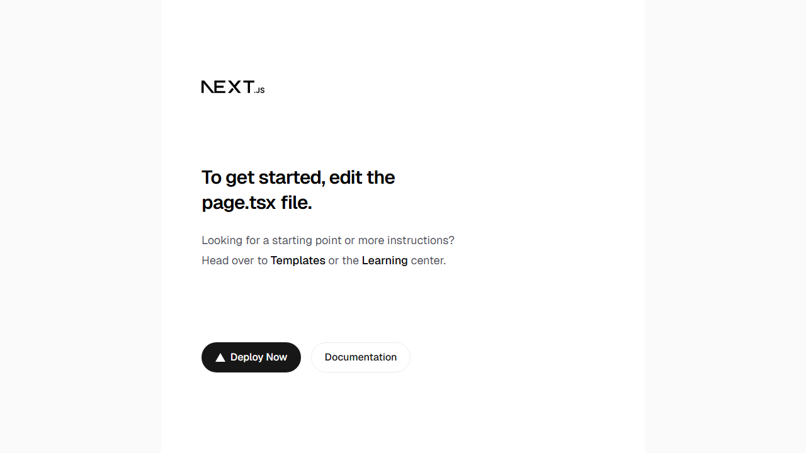

# Heaven's Classics

A modern redesign of a classic literature website, built with Next.js, React, and Tailwind CSS. This project reimagines the reading experience with a contemporary, elegant interface for exploring timeless literary works.

## Tech Stack

- **Framework**: Next.js 16 (App Router)
- **UI Library**: React 19
- **Language**: TypeScript
- **Styling**: Tailwind CSS v4
- **Linting**: ESLint 9

## Repository Structure

```text
heavens-classics/
|-- app/                    # Next.js App Router pages and layouts
|   |-- layout.tsx         # Root layout with fonts and metadata
|   |-- page.tsx           # Home page
|   |-- globals.css        # Global styles
|   `-- page.module.css    # Page-specific styles
|-- public/                # Static assets
|-- demo/                  # Demo content
|-- .github/               # GitHub configs, workflows, and issue templates
|-- package.json           # Project dependencies and scripts
|-- next.config.ts         # Next.js configuration
|-- tsconfig.json          # TypeScript configuration
|-- postcss.config.mjs     # PostCSS and Tailwind CSS config
|-- eslint.config.mjs      # ESLint configuration
`-- .gitignore             # Git ignore patterns
```

## Preview



## Getting Started

### Prerequisites

- Node.js 20 or higher
- npm 10+ (comes with Node.js)

### Installation

```bash
# Clone the repository
git clone https://github.com/coderooz/heavens-classics.git

# Navigate to project directory
cd heavens-classics

# Install dependencies
npm install
```

### Development

```bash
# Start the development server
npm run dev

# Open http://localhost:3000 in your browser
```

### Build

```bash
# Build for production
npm run build

# Start the production server
npm start
```

## Scripts

| Command | Description |
| --- | --- |
| `npm run dev` | Start development server with hot reload |
| `npm run build` | Build optimized production bundle |
| `npm run start` | Start production server |
| `npm run lint` | Run ESLint checks |

## Documentation

- [Project Documentation](./project.n.md) - Comprehensive project documentation template
- [Contributing Guide](./CONTRIBUTING.md) - How to contribute to this project
- [Changelog](./CHANGELOG.md) - Version history and notable changes

## Professional Standards

This repository follows professional best practices:

- **Conventional Commits** for clear commit history
- **Semantic Versioning** for releases
- **Code Owners** for PR review assignment
- **Automated Dependency Updates** via Dependabot
- **Code Quality Gates** via GitHub Actions

## Contributing

Contributions are welcome! Please read our [Contributing Guidelines](./CONTRIBUTING.md) before submitting PRs.

## Related

- [Coderooz Docs Template](https://github.com/coderooz/Docs-Template) - Documentation template used as a reference for this repository

## License

This project is licensed under the MIT License - see the [LICENSE.md](./LICENSE.md) file for details.

---

Built with by [Ranit Saha (Coderooz)](https://www.coderooz.in)